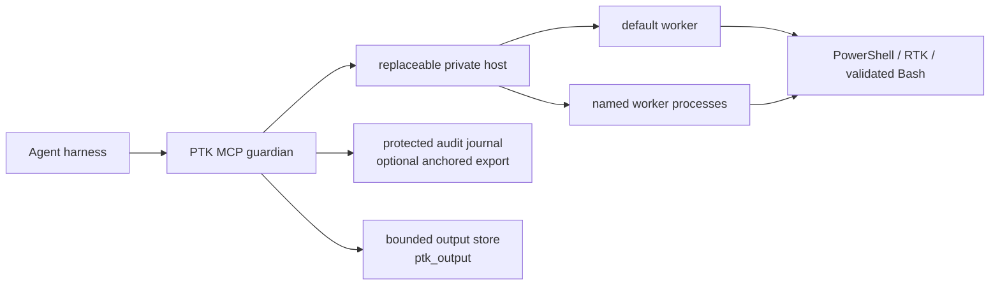

# PowerShell Token Killer (`ptk`)

[](https://github.com/AlsoBeltrix/PowerShell-Token-Killer/actions/workflows/ci.yml)

PTK is an audited, token-efficient PowerShell execution service for AI agent
harnesses. In the approved architecture, each harness owns one public-pipe
guardian, one replaceable private host, and one or more isolated warm
PowerShell worker sessions. Modules, variables, working directory, and
authenticated connections persist inside the selected session—and disappear
with the harness.

The agent submits the original command once. PTK owns PowerShell state,
internal RTK/Bash routing, output shaping and recovery, worker lifecycle, and a
mandatory pre-effect audit trail.

> [!IMPORTANT]
> **This README describes the approved end-state contract.** The current
> development tree already implements mandatory audit, single-execution
> routing, cold background jobs, same-invocation `ptk_output` recovery, and one
> in-process default `SessionRuntime`. The guardian/private-host split,
> worker-process sessions, automatic recovery, named sessions, hardened
> containment, and public release installers are approved work still being
> built. See [`.agents/state.md`](.agents/state.md) for the exact implementation
> boundary. PTK has not had a public release.

## Why PTK

- **Warm, explicit state.** Foreground calls run in a selected PowerShell 7
  session. Heavy modules and connections load once per session, not once per
  command.
- **Shape-aware output.** PowerShell objects become compact typed summaries,
  eligible native commands use RTK's filters, log-shaped text is deduplicated,
  and ordinary text is cleaned and bounded.
- **Single-execution semantics.** Routing may fall back before user work
  starts. Once work starts, PTK never retries it and never asks the model to
  reconstruct the command.
- **Recoverable context.** When PTK captures a same-invocation artifact,
  `ptk_output` can retrieve an elided middle without rerunning the operation.
- **Mandatory audit.** PTK reserves capacity and persists acceptance, intent,
  and dispatch evidence before effects. It then records job lifecycle facts;
  if the required local evidence cannot be persisted, new effectful work does
  not start.
- **Contained sessions.** In the target architecture, each warm session is a
  separate worker process. Reset, timeout, or loss of one session does not
  silently replace or corrupt another.

PTK is not a sandbox or authorization boundary. Commands inherit the identity,
privileges, network access, and upstream RBAC of the harness that launched PTK.

## Target Architecture



One harness owns one guardian and one replaceable private host. Each session
owns one serial PowerShell runspace inside its own worker process; different
sessions can progress independently. The guardian owns audit, public IDs,
output artifacts, frozen bootstrap metadata, and recovery generations. The
host coordinates workers without owning the public MCP pipe.

While that pipe remains open, inactivity never recycles the guardian, host, or
warm workers. A failed worker or host is replaced automatically with a new
generation and only its declared frozen baseline; uncertain work is never
replayed. Guardian failure still ends the MCP connection and requires the
client to start a new session.

While recovery is active, PTK refuses dependent work instead of queueing it.
A safe refusal tells the agent the recovery phase and attempt, then says to
check `ptk_state` in a specific number of milliseconds. That delay is for the
state check, not permission to rerun the command: the agent submits a fresh
request only after the named host/session readiness gate reports ready. PTK
checks the gate and generation again immediately before private dispatch. If
they changed before dispatch, PTK returns another no-effect refusal. Once
request bytes may have been written, PTK reports the outcome as unknown and
never retries it; the readiness check does not pretend that boundary is safe.

Sessions are deliberately harness-scoped. There is no daemon, reattachment,
cross-harness session, shared runspace, or durable session key in this design.

## Sessions

The reserved `default` session preserves today's unqualified tool calls:

```text
ptk_invoke(script="Import-Module ActiveDirectory")
ptk_invoke(script="Get-ADUser alice")
```

Named sessions make independent warm contexts explicit:

```text
ptk_session(action="open", name="ad")
ptk_invoke(session="ad", script="Import-Module ActiveDirectory")

ptk_session(action="open", name="exo")
ptk_invoke(session="exo", script="Connect-ExchangeOnline ...")

ptk_state(session="ad")
ptk_reset(session="exo")
```

Target session rules:

- Names are harness-local semantic aliases such as `ad`, `exo`, or `build`.
  Every non-default operation names its session; there is no mutable `select`.
- Unknown or closed named sessions never fall back to `default` and never
  auto-create after a typo.
- `reset` and `restart` replace the entire target worker and increment its
  generation. They do not affect another session.
- After an execution timeout returns its terminal and the old worker tree is
  confirmed dead, an otherwise eligible session automatically starts its next
  generation from the fresh declared baseline. The timed-out call is never
  replayed.
- An optional `expectedGeneration` prevents a stale caller from acting on a
  replacement worker.
- Optional templates loaded from `~/.ptk/profiles.json` can freeze a bootstrap
  script, startup limit, labels, and cold-background policy for the harness
  lifetime. Templates are operational configuration, not authorization, and
  must not contain inline secrets.
- Closing `default` leaves its reserved slot cold; the next unqualified
  effectful call starts a new generation. Closed named sessions require an
  explicit `open`.

### Long-running work

Long work has two distinct paths:

- Raise `timeoutSeconds` when work needs the selected warm foreground session.
- Use `background=true`, then poll `ptk_job`, for cold stateless work such as
  builds and watchers.

Cold background jobs do not borrow a session's modules, variables, or
authenticated connections. `default` permits cold jobs for compatibility;
named sessions deny them unless their first binding or template explicitly
allows them. Warm asynchronous session jobs are outside this design.

## MCP Tools

The target public surface keeps the current tools and adds session lifecycle:

| Tool | Purpose |
| --- | --- |
| `ptk_invoke` | Execute the original script once in the selected warm session, or start an explicitly allowed cold background job. |
| `ptk_job` | Read status/output or kill a cold job using a guardian-owned, non-reused public job ID. |
| `ptk_output` | Read, search, or inspect an immutable same-invocation artifact. It accepts no script and never executes work. |
| `ptk_state` | Report guardian, host, and session health plus lifecycle, engine, jobs, cwd, and environment/PATH/variable drift where available. |
| `ptk_reset` | Replace one session worker, terminate its managed jobs, and restore its frozen baseline. |
| `ptk_session` | List sessions, open named sessions, and close or restart named/default sessions. |

Target signatures, shown compactly:

```text
ptk_invoke(script, route="auto", background=false, timeoutSeconds=0,
           raw=false, session="default")
ptk_job(action, id, offset=0, session="default")
ptk_state(listAvailable=false, session="default")
ptk_reset(session="default", expectedGeneration=0, force=false,
          timeoutSeconds=0)
ptk_session(action, name=null, template=null, allowColdBackground=null,
            expectedGeneration=0, force=false, timeoutSeconds=0)
ptk_output(handle, action="read", offset=0, maxBytes=<bounded>, pattern=null)
```

`ptk_session` and the `session` arguments arrive with the worker/named-session
slices; they are not yet present on current `master`.

## Routing and Output

The dialect is PowerShell 7. With `route="auto"`, PTK plans from the exact
submitted text. Foreground calls resolve against the selected session's
already-loaded command state; cold background jobs resolve against a pristine
cold command table:

1. Cmdlets, aliases, functions, scripts, variables, PowerShell object
   pipelines, and mixed dataflow execute unchanged in PowerShell: the selected
   warm runspace for foreground work or the cold child for background work.
2. A semantically eligible terminal native application is offered to RTK.
   RTK chooses a specialized filter or passthrough.
3. A narrow parse-fatal Bash shape may run through startup-suppressed Bash only
   after PTK's detector and an independently bounded validation both accept
   the exact bytes. Clean-parsing Bash-like mistakes receive a labeled dialect
   refusal instead.
4. Missing RTK, an ineligible route assertion, or another optimization failure
   may fall back to the exact original only while PTK can prove no user process
   started. There is never a post-start retry.

Overrides are deliberately narrow:

- `route="pwsh"` consents to interpret the exact original text as PowerShell
  and bypasses dialect/Bash/RTK execution routing. Normal capture and shaping
  still apply.
- `route="rtk"` asserts RTK routing for an eligible terminal native command.
  A safe pre-start failure is labeled and falls back exactly once.
- `raw=true` is deprecated compatibility telemetry. It does not change the
  interpreter, route, process, capture, bounds, or shaping, and it is not an
  output-recovery mechanism.

Output is shaped by provenance:

- PowerShell objects become compact typed summaries before formatting.
- RTK-routed native output is treated as already RTK-processed and is never
  sent through `rtk log` a second time.
- Direct log-shaped text may be deduplicated through RTK.
- Plain text has terminal control sequences removed and is bounded by a
  labeled head/tail window.

When PTK owns a capture, the result may include a `ptk_output` handle for the
immutable artifact. Handles remain readable across reset/restart/close until
ordinary TTL or quota eviction, but never outlive the harness guardian.
Expired, evicted, unavailable, and incomplete artifacts are reported
explicitly.

The end-state design was frozen against adjacent RTK commit `5d32d07` and an
independent RTK 0.43.0 runtime probe; neither exposed the trustworthy
machine-readable capture seam PTK needs for raw recovery. Under that
seam-absent contract, RTK-routed work remains single-execution but reports
`recovery=unavailable`; PTK never parses a human tee-path hint or reruns the
command. A future negotiated seam can add a truthful handle without changing
execution routing.

## Mandatory Audit

The guardian records every accepted PTK operation and spawned-job lifecycle
in a protected journal. The default local-only mode writes under
`~/.ptk/audit` and requires no collector, credentials, or network service.
Anchored mode adds authenticated OTLP/HTTP export with durable local spooling.

Important boundaries:

- Exact submitted script evidence is protected separately and flushed before
  dispatch. If required evidence or journal persistence fails, effectful work
  does not start.
- A SIEM outage does not immediately block while the durable spool remains
  healthy. Capacity exhaustion stops new calls rather than silently deleting
  unacknowledged evidence.
- A narrow unrecorded `ptk_state` health diagnostic remains available when the
  audit boundary itself is unavailable.
- Local hash chaining exposes gaps and corruption; it is not same-user tamper
  resistance. External anchoring supplies the independent trust boundary.
- Scripts and output artifacts can contain passwords, tokens, customer data,
  or other secrets. Restrict and retain `~/.ptk` accordingly.
- PTK audits operations PTK accepts. It cannot claim complete-host coverage
  for alternate shells, detached processes, services, schedulers, SSH/WMI, or
  effects inside remote systems.

See [mandatory local audit](server/README.md#mandatory-local-audit) and
[anchored export](server/AUDIT-EXPORT.md) for schemas, retention, failure
behavior, evidence administration, and SIEM routing.

## Security and Containment

Worker processes isolate warm state and reduce reset/crash blast radius. They
do not make hostile code safe and do not replace OS identity or upstream RBAC.

The guardian and private host own their respective containment layers and treat
confirmed process-tree termination as a prerequisite for replacement. If
containment cannot be confirmed, the affected scope becomes visibly
quarantined and refuses replacement rather than running overlapping
generations. Harness EOF tears down the host, every worker, and every managed
job.

Install and run PTK as the ordinary user who runs the agent harness. The public
installer refuses root/Administrator installation; launching the harness
elevated still launches PTK elevated.

## Installation

### Target v0.2.0 public install — not released yet

The approved release flow installs self-contained binaries without cloning
this repository or requiring the .NET SDK:

```powershell
# Windows
irm https://raw.githubusercontent.com/AlsoBeltrix/PowerShell-Token-Killer/master/install.ps1 | iex
```

```sh
# macOS / Linux
curl -fsSL https://raw.githubusercontent.com/AlsoBeltrix/PowerShell-Token-Killer/master/install.sh | sh
```

These URLs become usable when v0.2.0 is published; `install.ps1`, `install.sh`,
release assets, and the release workflow are not present yet.

The target installer:

- selects a smoke-tested `win-x64`, `win-arm64`, `linux-x64`, `linux-arm64`,
  or `osx-arm64` asset and verifies it against `SHA256SUMS`;
- installs one exact matched guardian, private host, contracts, and containment
  helper set; partial or mixed-version payloads fail before initialization;
- installs per-user under `~/.ptk` and preserves user-owned configuration on
  upgrade/uninstall;
- registers only the public guardian with Claude Code when the `claude` CLI is
  available, otherwise prints its registration command, and prints Codex
  registration guidance;
- can install the redirect hook, whose public-installer default remains an
  explicit release decision; and
- supports uninstall, with destructive purge kept explicit.

The matched payload is self-contained and does not require an installed
PowerShell. The optional hook does require `pwsh`. Winget packaging is a
post-v0.2.0 follow-up, not a currently working install path.

The v0.2.0 binaries are not publisher-signed or Apple-notarized. The official
one-line paths are the tested install route; browser-downloaded or repackaged
archives may trigger SmartScreen or Gatekeeper warnings.

### Current development install

To publish the current checkout into the canonical `~/.ptk` layout and
register detected harnesses:

```powershell
pwsh -NoProfile -File scripts/dev-install.ps1
```

This is a developer path and requires PowerShell 7 plus the .NET SDK. Before
the guardian cutover lands, you can also register the checkout directly:

```powershell
claude mcp add ptk --scope user -- dotnet run -v q --project <repo>/server/PtkMcpServer
```

That direct no-argument server command is temporary development state, not a
released compatibility surface. Resilience R7 changes the development
installer and every future release registration to launch only the guardian,
then removes direct public server mode without a migration layer.

The committed `.mcp.json` is intentionally empty; a checkout does not install
itself into project scope.

### Windows Defender false positive (issue #7)

Microsoft Defender Antivirus has falsely detected `PtkMcpServer.dll` as
`Trojan:MSIL/AsyncRAT.AB!MTB` on Windows and quarantined it out of the build
output and the installed `~/.ptk/bin` payload. The symptom is an install or
build that appears to succeed while the DLL silently disappears;
`scripts/dev-install.ps1` now detects the missing file and fails with
guidance instead. The file has been submitted to Microsoft for a
false-positive determination (status tracked in
[issue #7](https://github.com/AlsoBeltrix/PowerShell-Token-Killer/issues/7);
submission runbook: `.agents/plans/defender-fp-submission.md`).

If you hit this: check Defender's protection history to confirm the
quarantine, restore the file only if you built it yourself from a checkout
you trust, and prefer a narrow, temporary exclusion for `~/.ptk/bin` over any
broad one — remove it once Microsoft ships corrected security intelligence.

## RTK Integration

[RTK](https://github.com/rtk-ai/rtk), the Rust Token Killer, owns native-command
filtering and log compression. PTK pins the selected executable identity at
startup and resolves it from `PTK_RTK_PATH` or `PATH`.

The current approved release contract recommends RTK but does not bundle or
silently download it. Without RTK, PTK still provides warm PowerShell state,
object compression, terminal cleanup, bounded text, same-invocation recovery
where PTK captured the bytes, and mandatory audit. Eligible native commands
fall back visibly to exact execution.

## Harness Integration and Hook

The currently implemented and live-verified redirect hook intercepts Claude
Code shell calls and points the agent at `ptk_invoke`. It is an adoption aid,
not a security control or an audited execution boundary. `PTK_DIRECT` in a
command comment is the explicit escape hatch when PTK is unavailable or the
command needs a real TTY. Other harnesses receive only the capabilities
recorded in the support matrix below.

For current live-verified registration, hook, and guidance behavior by
harness, see [the harness support matrix](docs/harness-support.md). The
developer installer runs the implemented per-harness initialization after a
successful install.

## Repository Layout and Verification

- `server/PtkMcpServer/` — current pre-guardian MCP server/runtime.
- `server/PtkMcpServer.Tests/` — server, audit, routing, and lifecycle tests.
- `src/PwshTokenCompressor.psd1` — PowerShell object/text shaping library.
- `scripts/` — development install and harness integration tooling.

The module is a library, not a separate CLI face. `ptk_invoke` is the product
surface.

Run the complete local verification battery:

```powershell
pwsh -NoProfile -Command "Invoke-Pester -Path tests/PwshTokenCompressor.Tests.ps1 -Output Minimal"
dotnet test server/PtkMcpServer.slnx
pwsh -NoProfile -File server/test-handshake.ps1
```

## More Documentation

- [MCP server setup, configuration, and operations](server/README.md)
- [Local audit and optional anchored/SIEM export](server/AUDIT-EXPORT.md)
- [Harness capability matrix](docs/harness-support.md)
- [Current implementation state](.agents/state.md)

## Credits

PowerShell Token Killer is named after, and heavily inspired by,
[RTK](https://github.com/rtk-ai/rtk). RTK proved that agent shell output should
be compressed at the source; PTK extends that idea to PowerShell objects, warm
session state, supervised execution, recoverable output, and mandatory audit.
